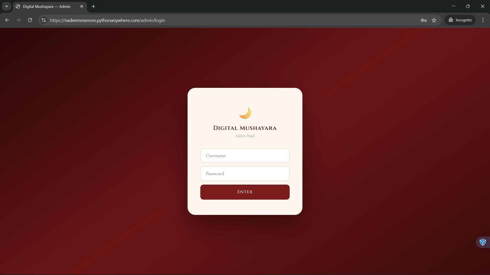
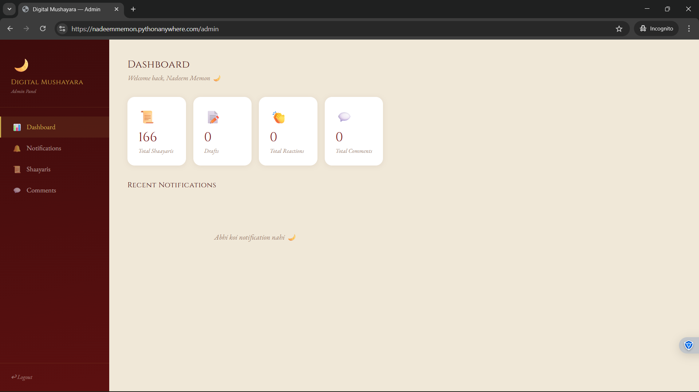
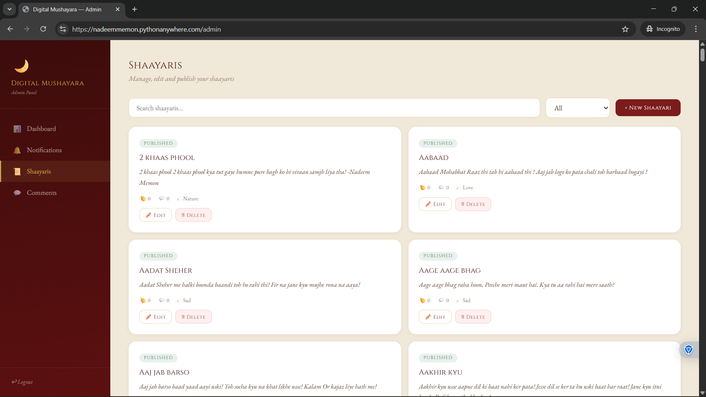

# 🌙 Digital Mushayara

> *A personal poetry platform — built by a poet, powered by code.*

**Live at:** [nadeemmemon.pythonanywhere.com](https://nadeemmemon.pythonanywhere.com)  
**Admin Panel:** [nadeemmemon.pythonanywhere.com/admin](https://nadeemmemon.pythonanywhere.com/admin)

---

## What is this?

Digital Mushayara is a full-stack web application to showcase, manage and share Urdu/Hindi shaayaris. It started as 261 poems locked in a notes app — and became a complete publishing pipeline with a CMS admin panel.

Write a shaayari on your phone → it's live on the internet in under 5 minutes.

---

## Screenshots

### Public Platform
| Home Feed | Shaayari Modal |
|---|---|
|  |  |

### Quote Card Export


### Admin Panel
| Login | Dashboard | Shaayaris |
|---|---|---|
|  |  |  |

---

## Features

### Public
- 🔍 **Search & Filter** — search by title or words, filter by mood (Love, Sad, Sufi, Philosophy, Nature, Nazm)
- 🔀 **Sorting** — A→Z, Newest, or Shuffle
- 👏 **Urdu Reactions** — Waah Waah, Bahut Khoob, Kya Baat Hai, Dil Ko Chua, Aah!
- 💬 **Comment Section** — Keh Do Kuch — anyone can leave a comment
- ‹ › **Navigation** — prev/next buttons or swipe on mobile
- 📸 **Quote Card Export** — 1080×1080 branded image, 4 styles, line selector, gold borders
- 📱 **Mobile Responsive** — bottom nav bar, swipe gestures, full-screen modal

### Admin Panel
- 🔐 **Secure Login** — password protected, only accessible to the owner
- 📊 **Dashboard** — total shaayaris, drafts, reactions, comments at a glance
- 🔔 **Notifications** — real-time feed of every reaction and comment
- ✏️ **Edit Shaayaris** — edit title, body, tags, status directly from UI
- ➕ **Add New Shaayaris** — write and publish without touching any files
- 📝 **Draft System** — save as draft, publish when ready
- 🗑️ **Moderate Comments** — delete comments from the panel

---

## Tech Stack

| Layer | Technology | Details |
|---|---|---|
| Backend | Python 3.10 + Flask | REST API, session auth, admin routes |
| Database | SQLite | Shaayaris, reactions, comments, notifications |
| Frontend | Vanilla HTML + CSS + JavaScript | Zero frameworks, pure web |
| Authentication | Session-based | SHA-256 password hashing, login_required decorator |
| Backup | Google Drive API v3 | OAuth2, automated .txt file download |
| Automation | Windows Task Scheduler | Weekly backup every Sunday 10am |
| Image Export | html2canvas | 1080×1080 quote cards, 4 gradient styles |
| Typography | Cormorant Garamond, Cinzel, EB Garamond | Google Fonts |
| Hosting | PythonAnywhere | Free tier, WSGI deployment |
| Version Control | Git + GitHub | github.com/nadeem12-cloud/digital-mushayara |

---

## Project Structure

```
digital-mushayara/
│
├── server.py                 # Flask backend — REST API + Admin routes
├── index.html                # Public frontend
├── admin.html                # Admin panel UI
├── init_db.py                # Run once to set up SQLite database
├── convert_to_json.py        # Converts .txt backup → shaayaris.json
├── shaayari_gdrive_sync.py   # Google Drive backup script
├── START_SERVER.bat          # One-click local server launcher
├── RUN_BACKUP.bat            # One-click backup runner
├── assets/                   # Screenshots
│
├── credentials.json          # Google OAuth2 (not committed)
├── token.json                # Google OAuth2 token (not committed)
├── mushayara.db              # SQLite database (not committed)
└── shaayaris.json            # Generated data file (not committed)
```

---

## API Endpoints

### Public
| Method | Endpoint | Description |
|---|---|---|
| GET | `/` | Serves the frontend |
| GET | `/api/shaayaris` | All published shaayaris with reactions |
| POST | `/api/react` | Add a reaction |
| POST | `/api/comment` | Add a comment |
| GET | `/api/comments/<id>` | Get comments for a shaayari |

### Admin (login required)
| Method | Endpoint | Description |
|---|---|---|
| GET | `/admin` | Admin dashboard |
| GET | `/admin/api/notifications` | All notifications |
| POST | `/admin/api/shaayari` | Add new shaayari |
| PUT | `/admin/api/shaayari/<id>` | Edit shaayari |
| DELETE | `/admin/api/shaayari/<id>` | Delete shaayari |
| DELETE | `/admin/api/comment/<id>` | Delete a comment |

---

## How to Run Locally

```bash
git clone https://github.com/nadeem12-cloud/digital-mushayara.git
cd digital-mushayara
pip install flask flask-cors
python init_db.py
python server.py
```

Open `http://localhost:5000` for public site  
Open `http://localhost:5000/admin` for admin panel

---

## The Publishing Pipeline

```
📱 Write on phone
    ↓ auto-sync to Google Drive
    ↓ weekly backup to laptop
    ↓ convert_to_json.py
    ↓ init_db.py → upload → reload
    ↓
🌙 Live on nadeemmemon.pythonanywhere.com
```

---

## About

Built by **Nadeem Memon** — poet, developer, dreamer.

> *"Har shaayari ko ek ghar mila. Har lafz ko ek manzil."*

🌙 [nadeemmemon.pythonanywhere.com](https://nadeemmemon.pythonanywhere.com)  
💻 [github.com/nadeem12-cloud/digital-mushayara](https://github.com/nadeem12-cloud/digital-mushayara)
