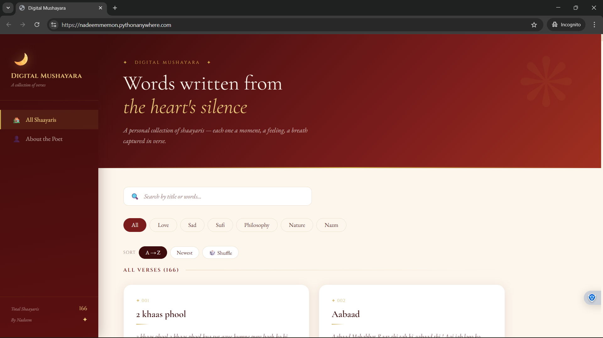
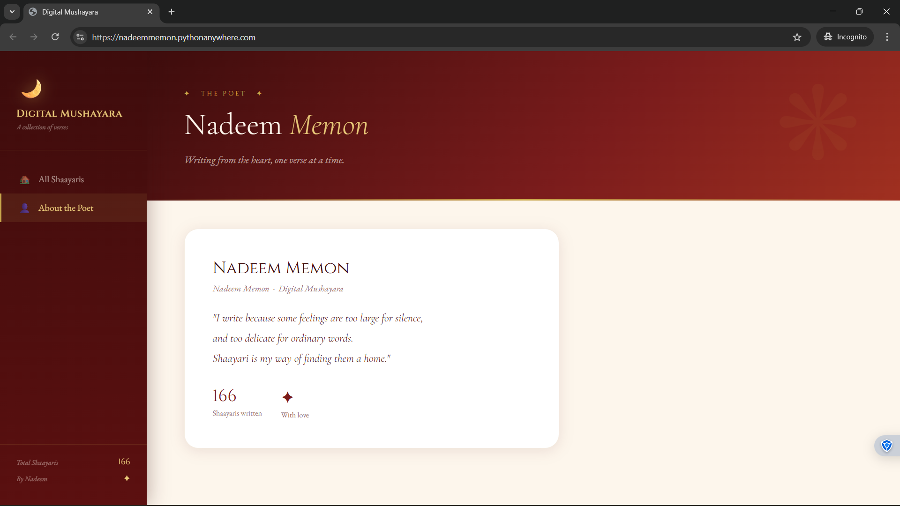

# 🌙 Digital Mushayara

> A personal poetry platform — built by a poet, powered by code.

[](https://nadeemmemon.pythonanywhere.com)
[](https://flask.palletsprojects.com)
[](https://developer.mozilla.org/en-US/docs/Web/JavaScript)

---

## 📌 What is Digital Mushayara?

**Digital Mushayara** is a full-stack web application to showcase, manage, and share Urdu/Hindi shaayaris. It started as **261 poems locked in a notes app** — and became a complete publishing pipeline.

> *Write a shaayari on your phone → it's live on the internet in under 5 minutes.*

This isn't just a portfolio project. It's a real product I use every day to publish my own poetry.

---

## 📸 Preview

| Home | Search & Filter |
|------|----------------|
|  |  |

| Quote Card Export |
|------------------|
|  |

---

## ✨ Features

- 🔍 **Search & Filter** — Search by title or words, filter by mood: Love, Sad, Sufi, Philosophy, Nature, Nazm
- 🔀 **Sorting** — A→Z, Newest, or Shuffle
- 👏 **Urdu Reactions** — Waah Waah · Bahut Khoob · Kya Baat Hai · Dil Ko Chua · Aah!
- 💬 **Comment Section** — *Keh Do Kuch* — anyone can leave a comment
- ‹ › **Navigation** — Browse shaayaris with prev/next buttons or swipe on mobile
- 📸 **Quote Card Export** — Export any shaayari as a 1080×1080 branded image (4 styles, line selector, gold borders)
- 📱 **Mobile Responsive** — Bottom nav bar, swipe gestures, full-screen modal
- ☁️ **Automated Backup Pipeline** — Google Drive API syncs shaayaris weekly to laptop

---

## 🏗️ The Publishing Pipeline

```
📱 Write on phone (Vivo Notes)
        ↓
☁️  Auto-sync to Google Drive
        ↓
💾  Weekly backup to laptop (Task Scheduler → shaayari_gdrive_sync.py)
        ↓
📄  Convert to JSON (convert_to_json.py)
        ↓
⬆️  Upload shaayaris.json to PythonAnywhere
        ↓
🌙  Live on nadeemmemon.pythonanywhere.com
```

---

## 🛠️ Tech Stack

| Layer | Technology |
|-------|-----------|
| **Backend** | Python, Flask, flask-cors |
| **Frontend** | Vanilla HTML, CSS, JavaScript |
| **Data** | JSON (converted from .txt files) |
| **Backup** | Google Drive API, OAuth2 |
| **Automation** | Windows Task Scheduler |
| **Export** | html2canvas |
| **Fonts** | Cormorant Garamond, Cinzel, EB Garamond |
| **Hosting** | PythonAnywhere (free tier) |

---

## 📁 Project Structure

```
digital-mushayara/
│
├── server.py                  # Flask backend — REST API
├── index.html                 # Frontend — entire UI in one file
├── shaayaris.json             # All shaayaris (generated, not committed)
│
├── convert_to_json.py         # Converts .txt backup files → shaayaris.json
├── shaayari_gdrive_sync.py    # Google Drive backup script
├── START_SERVER.bat           # One-click local server launcher
├── RUN_BACKUP.bat             # One-click backup runner
│
├── credentials.json           # Google OAuth2 credentials (not committed)
├── token.json                 # Google OAuth2 token (not committed)
│
└── README.md
```

---

## 🔌 API Endpoints

| Method | Endpoint | Description |
|--------|----------|-------------|
| GET | `/` | Serves the frontend |
| GET | `/api/shaayaris` | Returns all shaayaris with reactions |
| POST | `/api/react` | Add a reaction to a shaayari |
| POST | `/api/comment` | Add a comment |
| GET | `/api/comments/<id>` | Get comments for a shaayari |
| GET | `/api/stats` | Total count and last updated |

---

## ⚙️ How to Run Locally

### 1. Clone the repo
```bash
git clone https://github.com/nadeem12-cloud/digital-mushayara.git
cd digital-mushayara
```

### 2. Install dependencies
```bash
pip install flask flask-cors
```

### 3. Add your shaayaris
- Run `convert_to_json.py` to generate `shaayaris.json` from your backup folder
- Or add your own `shaayaris.json` manually

### 4. Start the server
```bash
python server.py
```

### 5. Open in browser
```
http://localhost:5000
```

---

## 🔒 .gitignore

Never commit these:
```
credentials.json
token.json
shaayaris.json
__pycache__/
*.pyc
```

---

## 🔮 Future Scope

- [ ] Admin panel for publishing directly from browser
- [ ] User accounts & personal shaayari collections
- [ ] Audio recitation support
- [ ] Multi-poet support (open Mushayara)
- [ ] PWA — installable on mobile as an app

---

## 📄 License

Open source under the [MIT License](LICENSE).

---

## 🌙 About

Built by **Mohammad Nadeem Memon** — poet, developer, dreamer.

*"Har shaayari ko ek ghar mila. Har lafz ko ek manzil."*

- 🔗 [LinkedIn](https://www.linkedin.com/in/nadeem-memon-22b557229)
- 🐙 [GitHub](https://github.com/nadeem12-cloud)
- 🌙 [Live Platform](https://nadeemmemon.pythonanywhere.com)

---

> ⭐ If this resonates with you — as a reader, a poet, or a developer — leave a star.
